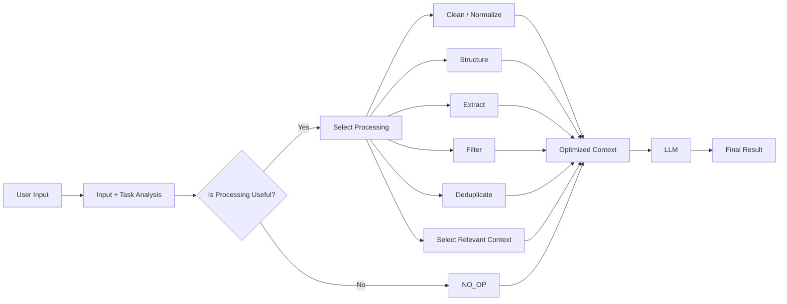
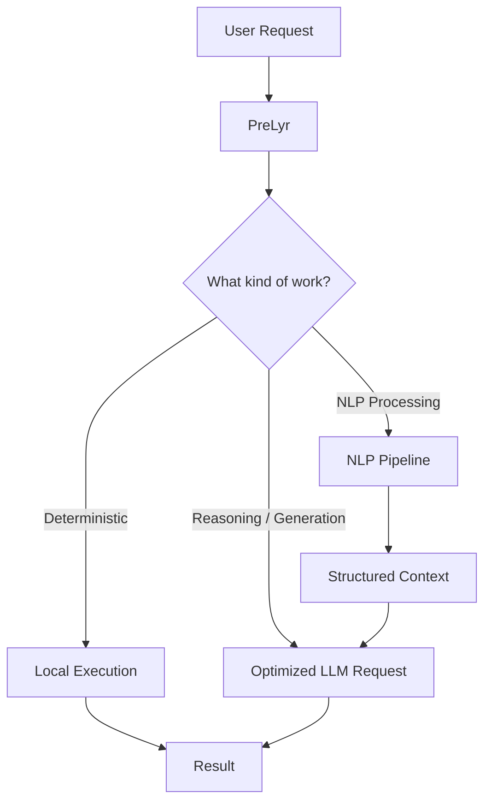
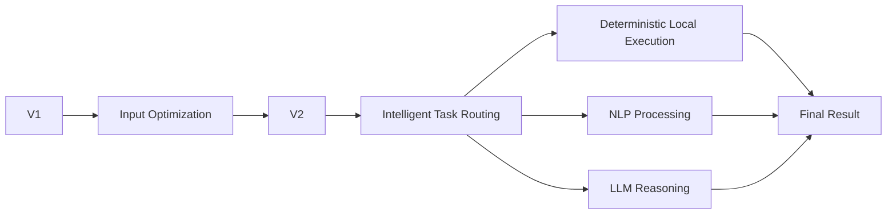

<div align="center">

# PreLyr

### The intelligent layer between your input and your LLM.

**Adaptive NLP middleware that decides what your input actually needs before it reaches an LLM.**

<br/>

[](https://www.python.org/)
[](#)
[](#)
[](#)

<br/>

> **Minimize unnecessary LLM work — not information.**

<br/>

[How It Works](#-how-it-works) • [Architecture](#-architecture) • [Examples](#-real-world-examples) • [Roadmap](#-roadmap)

</div>

---

# What is PreLyr?

Modern AI applications often send **everything directly to an LLM**.

Large documents. Terminal logs. Repeated text. Noisy input. Poorly structured requests.

But not every input needs the same amount of processing.

**PreLyr sits between your application and the LLM to decide what processing is actually useful before the model sees the request.**

```text
USER INPUT
    ↓
  PreLyr
    ↓
Analyze input + understand task
    ↓
Decide whether processing is useful
    ↓
 ┌───────────────┬─────────────────────┐
 │               │                     │
 ▼               ▼                     ▼
NO_OP        Selective NLP         Local / future
             processing            deterministic work
 │               │                     │
 └───────────────┴──────────┬──────────┘
                            ↓
                   Optimized context
                            ↓
                           LLM
                            ↓
                        FINAL RESULT
```

### In simple words

PreLyr asks:

> **"What does this input actually need?"**

Instead of blindly preprocessing every request, it can pass clean input through, selectively transform noisy input, or eventually route deterministic work away from the LLM entirely.

---

# Why PreLyr?

Without an optimization layer:

```text
User → Large / Noisy Input → LLM
```

With PreLyr:

```text
User → PreLyr → Relevant / Optimized Context → LLM
```

The objective is **not** to remove as many tokens as possible.

The objective is:

> **Eliminate unnecessary LLM work while preserving the information required to solve the task correctly.**

---

# The Core Principle

## Minimize unnecessary LLM work — not information.

A shorter prompt is not automatically a better prompt.

If information is removed and the result becomes less accurate, the optimization failed.

PreLyr therefore treats:

```text
Information correctness
        ↓
Task relevance
        ↓
Unnecessary-work reduction
        ↓
Token / context optimization
```

as the preferred order of priorities.

> **Minimum unnecessary context ≠ minimum context.**

---

# How It Works

PreLyr is adaptive by design.



The key decision is simple:

```text
                INPUT
                  │
                  ▼
          Analyze + Understand
                  │
                  ▼
       ┌────────────────────────┐
       │ Is processing useful?  │
       └───────────┬────────────┘
                   │
         ┌─────────┴─────────┐
         ▼                   ▼
       NO_OP              PROCESS
         │                   │
         │          Select only what
         │          is actually useful
         │                   │
         └─────────┬─────────┘
                   ▼
             Optimized Context
                   │
                   ▼
                  LLM
```

---

# Adaptive Processing

PreLyr does **not** assume every input needs preprocessing.

Possible processing decisions include:

| Decision | Purpose |
|---|---|
| `NO_OP` | Pass input through unchanged |
| `CLEAN` | Remove genuine noise |
| `NORMALIZE` | Normalize inconsistent input |
| `STRUCTURE` | Give unstructured input a useful structure |
| `EXTRACT` | Extract task-relevant information |
| `FILTER` | Remove irrelevant content |
| `DEDUPLICATE` | Reduce genuine repetition |
| `SELECT_CONTEXT` | Select task-relevant context |
| `COMPRESS` | Reduce unnecessary representation |
| `CHUNK` | Split large content intelligently |
| `LOCAL_EXECUTION` | Perform deterministic work locally |
| `LLM_REQUIRED` | Route reasoning or generation to an LLM |

Multiple operations may be combined when necessary.

---

# Information Preservation

PreLyr is **lossless-by-default**.

Important requirements, technologies, dependencies, constraints, assumptions, and future plans should not be removed simply to reduce token count.

Example:

```text
Current backend: Flask
Database: PostgreSQL
Possible future migration: FastAPI
```

All three can be meaningful context.

PreLyr should not remove `Flask` just because `FastAPI` appears later.

The goal is not:

```text
"smallest possible context"
```

The goal is:

```text
"smallest unnecessary context while preserving what matters"
```

---

# Task-Aware Processing

The same input can require different processing depending on what the user is trying to do.

```text
Same Document
      │
      ├── "Summarize it"
      ├── "Find deadlines"
      ├── "Extract requirements"
      └── "Compare sections"
```

So PreLyr considers:

```text
INPUT + TASK
      ↓
PROCESSING DECISION
```

rather than looking at the input alone.

---

# Real-World Examples

## 01 — Clean Question

```text
User:
"What is Flask?"
```

This is already concise and meaningful.

```text
Input → PreLyr → NO_OP → LLM
```

No unnecessary preprocessing.

---

## 02 — Large Terminal Log

A developer sends thousands of lines of terminal output containing warnings, repeated logs, stack traces, and one actual failure.

```text
Large Terminal Log
        ↓
      PreLyr
        ↓
Analyze + Select
        ↓
Relevant Error Context
        ↓
       LLM
```

The useful stack-trace context should remain available while genuine noise and repetition can be reduced.

---

## 03 — Large Document

```text
User
  ↓
Large document
  ↓
Task: "Find all deadlines"
  ↓
PreLyr
  ↓
Extract relevant deadline information
  ↓
Structured context
  ↓
LLM
```

The document is processed according to the task rather than treated as one undifferentiated block.

---

## 04 — Repetitive Input

```text
Repeated information
        ↓
      PreLyr
        ↓
Detect genuine redundancy
        ↓
Preserve meaning
        ↓
Reduced representation
        ↓
       LLM
```

---

## 05 — Deterministic Work

Some tasks can eventually be completed without an LLM.



This is a major part of PreLyr's long-term direction: **don't use an LLM for work that does not actually require one.**

---

# Architecture

## V1 Architecture


### Architecture principles

PreLyr is designed to be:

- **Modular**
- **Extensible**
- **Model-agnostic**
- **LLM-provider-agnostic**
- **Testable**
- **Observable**
- **Conservative about information loss**

The middleware should not be tightly coupled to one LLM provider.

---

# PreLyr V1

### Current focus

```text
┌──────────────────────────────────────────────┐
│                  PreLyr V1                   │
├──────────────────────────────────────────────┤
│                                              │
│  ✓ Input analysis                            │
│  ✓ Task / intent understanding               │
│  ✓ Cleaning / normalization                  │
│  ✓ Redundancy detection                      │
│  ✓ Deduplication                             │
│  ✓ Structure extraction                      │
│  ✓ Relevant-context selection                │
│  ✓ Selective compression                     │
│  ✓ Intelligent NO_OP                         │
│  ✓ LLM-ready optimized context               │
│                                              │
└──────────────────────────────────────────────┘
```

V1 focuses on **LLM input optimization**.

It is intentionally not trying to become an autonomous-agent framework, generic RAG platform, chatbot, or LLM replacement.

---

# What PreLyr Is NOT

```text
❌ A new LLM
❌ A chatbot
❌ An LLM replacement
❌ A generic RAG platform
❌ An autonomous-agent framework
❌ A document-management system
❌ An NLP library built from scratch
```

PreLyr is:

```text
Input Understanding
        ↓
Selective NLP Processing
        ↓
Context Optimization
        ↓
Task Routing
        ↓
LLM Interaction
```

---

# Why Middleware?

PreLyr is intended to sit between an application and an LLM.

```text
┌──────────────────────┐
│     Application      │
│                      │
│ Chat UI              │
│ Mobile App           │
│ Developer Tool       │
│ API                  │
└──────────┬───────────┘
           │
           ▼
┌──────────────────────┐
│        PreLyr        │
│                      │
│ Analyze              │
│ Decide               │
│ Process              │
│ Optimize             │
└──────────┬───────────┘
           │
           ▼
┌──────────────────────┐
│         LLM          │
│                      │
│ Cloud / Local / Any  │
│ compatible model     │
└──────────────────────┘
```

This allows PreLyr to become an infrastructure component inside different AI applications without becoming the application itself.

---

# Integration Concept

```text
              Your Application
                     │
                     ▼
                   PreLyr
                     │
           ┌─────────┼─────────┐
           ▼         ▼         ▼
        Cloud LLM  Local LLM  Other Model
```

The end user can continue using the same AI interface while PreLyr operates as the optimization layer underneath it.

---

# Design Principles

### 1. Adaptive, not automatic

Don't preprocess just because preprocessing exists.

### 2. Lossless by default

Preserve useful information unless there is a strong reason to transform it.

### 3. Task-aware

Input optimization should consider what the user is trying to accomplish.

### 4. Model-agnostic

PreLyr should remain independent of any single provider or model family.

### 5. Library-first

Use mature NLP and document-processing libraries where they solve the problem well instead of reinventing them.

### 6. Modular

Processing components should remain replaceable and independently testable.

### 7. Measure real value

The primary metric is not:

```text
"How many tokens did we remove?"
```

The better question is:

```text
"How much unnecessary LLM work did we eliminate
while preserving the information required to solve
the task correctly?"
```

---

# Performance Philosophy

A smaller request is not automatically a better request.

```text
                 INPUT
                   │
       ┌───────────┴───────────┐
       ▼                       ▼
Too much information     Too little information
       │                       │
       ▼                       ▼
Unnecessary work         Lost context
       │                       │
       └───────────┬───────────┘
                   ▼
             PRELYR GOAL
                   │
                   ▼
      Less unnecessary work
               +
         preserved meaning
```

PreLyr aims for the useful middle ground.

---

# Long-Term Vision

The long-term goal is larger than prompt shortening.

```text
                USER REQUEST
                      │
                      ▼
                   PRELYR
                      │
                      ▼
             Understand the request
                      │
                      ▼
             Decide what work is needed
                      │
          ┌───────────┼────────────┐
          ▼           ▼            ▼
     Local Work    NLP Work     LLM Work
          │           │            │
          └───────────┼────────────┘
                      ▼
                  FINAL RESULT
```

The bigger question becomes:

> **Why should an LLM do work that doesn't actually require an LLM?**

---

# V1 → V2



### V1 — Optimize the input

Focus on cleaning, structuring, extracting, filtering, deduplicating, selecting context, and making an intelligent `NO_OP` decision.

### V2 — Optimize the work

The next step is to determine what can be done locally, what should be handled by deterministic NLP, and what truly requires LLM reasoning or generation.

---

# Who is PreLyr for?

PreLyr is aimed at developers building:

- AI applications
- LLM-powered APIs
- AI assistants and copilots
- Developer tools
- Document-processing systems
- Local LLM applications
- Cloud LLM applications

---

# Technology Philosophy

PreLyr is **not** intended to be an educational "NLP from scratch" implementation.

Where appropriate, it should rely on mature libraries for:

- NLP
- text processing
- document parsing
- tokenization
- similarity
- structured extraction
- model interaction

Each dependency should answer:

```text
What problem does it solve?
        ↓
Why does PreLyr need it?
        ↓
What are the alternatives?
        ↓
What are the trade-offs?
        ↓
Does it belong in V1 or later?
```

This keeps the project focused and maintainable.

---

# Project Structure

```text
PreLyr/
│
├── prelyr/
│   ├── analyzer/
│   ├── processors/
│   ├── optimizer/
│   ├── routing/
│   ├── models/
│   └── core/
│
├── tests/
├── examples/
├── docs/
│
├── README.md
├── pyproject.toml
└── LICENSE
```

The implementation structure can evolve as V1 matures.

---

# Getting Started

> Installation and usage instructions will expand as the V1 API stabilizes.

### Clone

```bash
git clone https://github.com/mogesh-developer/PreLyr.git
cd PreLyr
```

### Create a virtual environment

```bash
python -m venv venv
```

### Activate — Windows

```powershell
venv\Scripts\activate
```

### Activate — Linux / macOS

```bash
source venv/bin/activate
```

### Install

```bash
pip install -e .
```

---

# Example Integration Concept

A future PreLyr integration may look conceptually like:

```python
from prelyr import PreLyr

prelyr = PreLyr()

result = prelyr.prepare(
    input=user_input,
    task=user_task,
)

response = llm.generate(result.context)
```

The exact API will evolve with the V1 implementation.

---

# Roadmap

```text
                 PRELYR ROADMAP

        ┌─────────────────────────┐
        │          V1             │
        │                         │
        │ Input Optimization      │
        │ Adaptive NLP             │
        │ Context Selection       │
        │ Intelligent NO_OP       │
        └────────────┬────────────┘
                     │
                     ▼
        ┌─────────────────────────┐
        │          V2             │
        │                         │
        │ Intelligent Task Routing│
        │ Deterministic Execution │
        │ Local Processing        │
        │ NLP / LLM split         │
        └────────────┬────────────┘
                     │
                     ▼
        ┌─────────────────────────┐
        │      Long-Term          │
        │                         │
        │ Adaptive AI Middleware  │
        │ for LLM Applications    │
        └─────────────────────────┘
```

---

# Current Status

🚧 **PreLyr V1 — Active Development**

The current release focuses on establishing the core adaptive input-optimization middleware.

The project is intentionally being built incrementally around a clear boundary:

```text
Input Understanding
        ↓
Selective Processing
        ↓
Context Optimization
        ↓
Task Routing
        ↓
LLM Interaction
```

---

# Contributing

Contributions should remain aligned with the project's core purpose.

Before adding a feature, ask:

- Does it reduce unnecessary LLM work?
- Does it improve input quality?
- Is preprocessing actually necessary?
- Can the task be completed deterministically?
- Could the transformation remove important information?
- Does it belong in the current version?
- Should an existing library be used instead?

---

# License

License information will be added with the project release.

---

<div align="center">

## PreLyr

**Prepare the input. Reduce the unnecessary work. Let the model focus on what matters.**

<br/>

`Input → Understand → Decide → Optimize → LLM`

<br/>

**Built for the next generation of LLM applications.**

</div>
